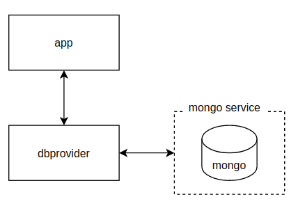
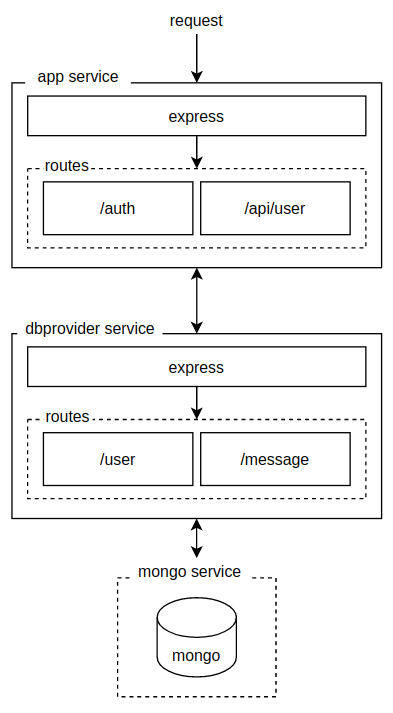

# Messaging Service Case Study for Armut.com

This document provides useful informations about the project and its deployment process.

**Table of Contents**

1. [About the project](#about-the-project)
    1. [Why is it scalable?](#why-is-it-scalable)
2. [How does it work?](#how-does-it-work)
3. [What is the deployment process?](#what-is-the-deployment-process)
4. [Use cases](#use-cases)
5. [API endpoints](#api-endpoints)
6. [Project utilities](#project-utilities)
    1. [Logging](#logging)
    2. [Tests](#tests)

## [About the project](#about-the-project)

This project provides services which users can register/login and send message to other users. Also users can block other users. Messaging functionality is not realtime, but implemented as an inbox.

### [Why is it scalable?](#why-is-it-scalable)

To make it scalable, I both separated mongo service and `dbprovider service` from app to make app service isolated. `app service` authenticates and handles business logic. It makes requests to get resources from dbprovider. dbprovider acts as an interface service for database. dbprovider uses `mongo service` to provide resources to clients. It may seem reduntant but it helps us to change our database engine without breaking our app. Also other services (if developed in the future) can also use database. I planned to implement it as auth, user and message services at first but later on I thought it will be quicker to implement an app service to handle multiple functionalities and to met acceptance criterias.

Also while writing the code, I tried to apply Clean Code and SOLID principles. So it is easy to add new features for future development with less bug.

**Services**

**Flow and routing in detail**

## [How does it work?](#how-does-it-work)

This project designed to run as docker containers. It uses **docker-compose.yml** file and **.env** file to set env variables for services. Currently there are 3 services:

-   **app**: authenticates user and implements functionalites
-   **dbprovider**: provides db. Currently uses mongo service. Acts as a db interface.
-   **mongo**: runs mongo db.

## [What is the deployment process?](#what-is-the-deployment-process)

This project can be deployed on a host by using docker-compose commands. All services are isolated and can communicate through a network (currently on the same host). Run provided `./init.sh` to run project with docker-compose.

## [Use cases](#use-cases)

1. Users can register with username and password
2. Users can login with username and password
3. Users can send messages to other users by their username
4. Users can block another user by their username
5. Users cannot send message if reciever is blocked him/her
6. Users can view their all incoming messages

## [API endpoints](#api-endpoints)

| Method   | Route                                   | Function                 |
| -------- | --------------------------------------- | ------------------------ |
| **POST** | **/auth/register**                      | Register user            |
| **POST** | **/auth/login**                         | Login user               |
| **GET**  | **/api/user/:id/message?type=incoming** | Get incoming messages    |
| **POST** | **/api/user/:id/message**               | Send message             |
| **PUT**  | **/api/user/:id/block**                 | Block user with username |

Also **dbprovider** has its own API but I didn't include here.

## [Project utilities](#project-utilities)

### [Logging](#logging)

In this project, a logger module which uses `winston` package provides log persistency. Sample log is as below:

`2021-02-12T21:57:57.719Z | /api/user | 500 | A message couldn't send. request={safe(req.body)} | {error.stack}`

There is a duplication at logger module (is used in both app and dbprovider services) but it can be solved by deploying the logger module as a package so it is possible to use it by installing via a package manager (currently npm). 

### [Tests](#tests)
